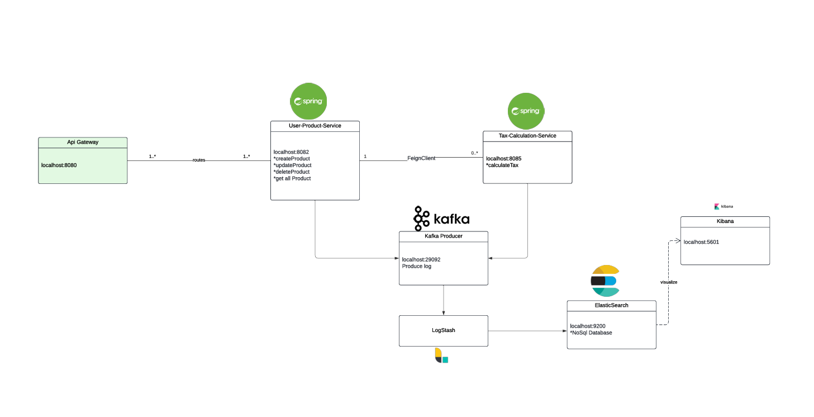

## **Project Title**

User-Product Microservice

## **Introduction**

This project is designed as a microservices-based system comprising two main services and a centralized logging mechanism. The first microservice is responsible for managing product data, performing CRUD operations, and storing product information in a MySQL database. The second microservice focuses on tax calculations, receiving product details from the first microservice, calculating the applicable taxes, and returning the computed values. The two services communicate seamlessly through Feign Client, enabling efficient and reliable service-to-service interaction.

For effective monitoring and analysis, both microservices generate logs, which are captured and stored in Elasticsearch through a Kafka pipeline. Kafka acts as a message broker, ensuring real-time log streaming from the services to Elasticsearch. The entire system is routed through an API Gateway, facilitating centralized access and routing on port 8080. This setup enhances scalability, observability, and modularity, making it ideal for maintaining high availability and ease of maintenance in a distributed architecture.

## **Installation**

To install Project Title, follow these steps:

1. Clone the repository: **`git clone https://github.com/username/project-title.git`**
2. Navigate to the project directory: **`cd Ayrotek`**
3. Inside the docs file.
	- docker-compose -f ./docs/db/docker-compose.yml up -d =====> Database
	- docker-compose -f ./docs/kafka-elasticsearch/docker-compose.yml up -d ====>kafka, logstash, kibana, elasticsearch
4. List kafka topics
	- docker exec -it kafka-cntr bash /bin/kafka-topics --list --bootstrap-server localhost:9092 
5. Create kafka topics
	- docker exec -it kafka-cntr bash /bin/kafka-topics --create --topic service-log-topic --bootstrap-server localhost:9092	 
4. Build the project: 
5. Start the project:
	- start gateway-server
	- start tax-calculation-server
	- start user-product-service
	

